# Sync Transcripts Feature - Implementation Summary

## ✅ Implementation Complete

The "Sync Transcripts" button is now fully functional and will automatically discover and import new RollCall transcripts since your last database update.

---

## What Was Built

### 1. **New Module: `rollcall_sync.py`**
A dedicated incremental sync module that:
- Determines the sync window automatically (from latest DB date to today)
- Uses Selenium to discover transcript URLs from RollCall search page
- Filters to only scrape new or empty transcripts (no duplicates)
- Extracts full dialogue using robust selector fallback logic
- Upserts transcripts into the database (insert new, update empty)
- Reports detailed progress in real-time

### 2. **Updated: `api_server.py`**
Enhanced the API server to:
- Replace subprocess scraper with in-process incremental sync
- Expose detailed progress via `/api/scraper/status` endpoint
- Report counts: `processed`, `total`, `added`, `updated`, `failed`, `discovered`
- Remove hard timeout (was 10 minutes, now runs until complete)
- Provide comprehensive error messages

### 3. **No UI Changes Required**
The existing button in `index.html` already:
- Calls `POST /api/scraper/refresh` to start sync
- Polls `GET /api/scraper/status` every 2 seconds for progress
- Displays progress and reloads data when complete
- Works perfectly with the new backend

---

## Test Results

### ✅ First Sync Test
- **Before**: 1,109 transcripts, max date 2025-12-14
- **After**: 1,122 transcripts, max date 2025-12-18
- **Added**: 13 new transcripts from Dec 15-18
- **Time**: ~25 seconds
- **Failures**: 0

### ✅ Second Sync Test (Deduplication)
- **Discovered**: 4 URLs in date range
- **Added**: 0 (all already existed in DB)
- **Database count**: 1,122 (no duplicates created)
- **Result**: ✅ Perfect deduplication

### ✅ API Integration Test
- API correctly serves all 1,122 transcripts
- New transcripts appear in search results
- Status polling shows live progress updates
- Button behavior matches design exactly

---

## How It Works

```mermaid
sequenceDiagram
    participant User
    participant UI as index.html
    participant API as api_server.py
    participant Sync as rollcall_sync.py
    participant DB as transcripts.db
    participant Web as RollCall.com

    User->>UI: Click "⟳ Sync Transcripts"
    UI->>API: POST /api/scraper/refresh
    API->>Sync: Start thread: run_incremental_sync()
    
    Sync->>DB: SELECT MAX(date) FROM transcripts
    DB-->>Sync: 2025-12-18
    
    Sync->>Web: Open search page (Selenium)
    Sync->>Web: Scroll to find Dec 18 - Today
    Web-->>Sync: List of URLs with dates
    
    Sync->>DB: Check which URLs need scraping
    DB-->>Sync: URLs not in DB or empty
    
    loop For each URL to scrape
        Sync->>Web: Scrape transcript page
        Web-->>Sync: Full dialogue + metadata
        Sync->>DB: UPSERT transcript
    end
    
    Sync-->>API: Return summary
    
    loop Every 2 seconds
        UI->>API: GET /api/scraper/status
        API-->>UI: {running, progress, counts}
        UI->>User: Update button text
    end
    
    UI->>API: GET /api/transcripts (reload)
    API->>DB: SELECT * FROM transcripts
    DB-->>API: All transcripts
    API-->>UI: JSON data
    UI->>User: Display updated results
```



---

## Usage

### From the Web Interface

1. **Open the UI**: `index.html` or `analytics_ui.html`
2. **Click the button**: "⟳ Sync Transcripts" (bottom left corner)
3. **Watch progress**: Button shows live status (e.g., "Scraping 8/13...")
4. **Wait for completion**: Usually 20-60 seconds depending on new transcripts
5. **Results appear**: Data reloads automatically, new transcripts are searchable

### From the Command Line (Testing)

```bash
# Trigger sync
curl -X POST http://localhost:5001/api/scraper/refresh

# Check progress
curl http://localhost:5001/api/scraper/status

# When running=false, it's complete
```

### Programmatic Usage

```python
from rollcall_sync import run_incremental_sync

def my_progress_callback(message, counts):
    print(f"Progress: {message}")
    print(f"Counts: {counts}")

summary = run_incremental_sync(
    db_path='data/transcripts.db',
    progress_callback=my_progress_callback
)

print(f"Added: {summary.added}")
print(f"Updated: {summary.updated}")
print(f"Failed: {summary.failed}")
```

---

## Key Features

### ✅ Incremental Updates
- Only scrapes transcripts since last database update
- Automatically calculates date window (last_date to today)
- No need to manually specify dates

### ✅ Deduplication
- Uses URL as unique key
- Skips transcripts already in database
- Never creates duplicates

### ✅ Repair Empty Transcripts
- If a transcript exists but has empty content (word_count=0)
- The sync will re-scrape and update it
- Useful for fixing failed imports

### ✅ Live Progress Reporting
- Real-time status updates via polling
- Detailed counts: discovered, processed, added, updated, failed
- Clear error messages if something goes wrong

### ✅ Robust Error Handling
- Retries with multiple CSS selectors if dialogue not found
- Continues on individual failures (doesn't abort entire sync)
- Reports all failures in status

### ✅ Safe to Run Anytime
- Can be run multiple times per day
- Won't duplicate existing transcripts
- Stops automatically when no new content found

---

## Technical Details

### Database Schema (No Changes Required)
The existing `transcripts` table already has all required columns:
```sql
- id (PRIMARY KEY)
- title, date, speech_type, location
- url (UNIQUE) -- Used for deduplication
- word_count, trump_word_count, speech_duration_seconds
- full_dialogue -- Full transcript text
- speakers_json -- Array of speaker names
- scraped_at, created_at -- Timestamps
```

### Sync Logic
1. **Determine window**: `SELECT MAX(date) FROM transcripts WHERE word_count > 0`
2. **Start from**: max_date - 1 day (safety buffer)
3. **End at**: today's date
4. **Discover URLs**: Selenium scroll on RollCall search page sorted by "Newest"
5. **Filter**: Keep only URLs not in DB or with empty content
6. **Scrape**: Use `DialogueExtractor` with robust selector fallbacks
7. **Upsert**: `INSERT ... ON CONFLICT(url) DO UPDATE`

### Performance
- **Discovery**: ~10-20 seconds (scrolling search page)
- **Per transcript**: ~1.5-2 seconds (with polite rate limiting)
- **13 transcripts**: ~25 seconds total
- **0 transcripts**: ~10 seconds (just discovery)

### Dependencies
- **Selenium**: For web scraping (Chrome headless)
- **scraper_utils.py**: Shared extraction logic
- **Flask**: API server (already used)
- **SQLite3**: Database (already used)

---

## Maintenance

### Daily Use
- Click "⟳ Sync Transcripts" when you want the latest data
- Usually takes less than a minute
- Safe to run as often as you like

### Monitoring
Check sync status programmatically:
```bash
curl http://localhost:5001/api/scraper/status | jq
```

### Troubleshooting

**Button doesn't respond?**
- Check that api_server.py is running: `ps aux | grep api_server`
- Check server logs: `tail -f /tmp/api_server_new.log`

**Sync fails with "Chrome driver" error?**
- Install/update Chrome: `brew install --cask google-chrome`
- Install ChromeDriver: `brew install chromedriver`

**No new transcripts found?**
- Database is up to date! This is normal.
- The sync found URLs but they're already in your DB

**Sync takes too long?**
- First sync after a long gap will take longer
- Each transcript takes ~2 seconds (rate limiting for politeness)
- Consider running sync more frequently

---

## Files Modified

1. **NEW**: `rollcall_sync.py` - Main sync logic
2. **UPDATED**: `api_server.py` - API endpoints for sync
3. **UNCHANGED**: `index.html` - Button already wired correctly
4. **UNCHANGED**: `analytics_ui.html` - Button already wired correctly
5. **UNCHANGED**: `scraper_utils.py` - Reused for extraction
6. **UNCHANGED**: `data/transcripts.db` - Schema unchanged, data updated

---

## Example Output

### Status Polling Response
```json
{
  "running": true,
  "progress": "Scraping 8/13: donald-trump-remarks-...",
  "processed": 8,
  "total": 13,
  "added": 7,
  "updated": 0,
  "failed": 0,
  "discovered": 13,
  "last_run": null
}
```

### Completion Response
```json
{
  "running": false,
  "progress": "Complete! Added: 13, Updated: 0, Failed: 0",
  "processed": 13,
  "total": 13,
  "added": 13,
  "updated": 0,
  "failed": 0,
  "discovered": 13,
  "last_run": {
    "success": true,
    "added": 13,
    "updated": 0,
    "failed": 0,
    "discovered": 13,
    "date_range": "2025-12-13 to 2025-12-18"
  }
}
```

---

## Success Metrics

✅ **Functionality**: Sync button works end-to-end  
✅ **Performance**: 13 transcripts in ~25 seconds  
✅ **Accuracy**: All 13 transcripts successfully added  
✅ **Deduplication**: Re-running adds 0 duplicates  
✅ **API Integration**: All endpoints working correctly  
✅ **Live Progress**: Status polling shows real-time updates  
✅ **Error Handling**: Graceful failures, clear error messages  
✅ **Data Quality**: Full dialogue text extracted correctly  

---

## Next Steps (Optional Enhancements)

### Future Improvements (Not Implemented)
1. **Scheduled Syncs**: Add cron job to run sync daily
2. **Email Notifications**: Alert when new transcripts added
3. **Retry Failed**: Auto-retry failed transcripts after initial sync
4. **Parallel Scraping**: Scrape multiple URLs simultaneously (faster)
5. **Incremental Discovery**: Cache discovered URLs to speed up subsequent syncs
6. **Speaker Extraction**: Parse and store individual speaker segments
7. **Sentiment Analysis**: Add sentiment scores during sync

These are not necessary for the core functionality but could be added later if desired.

---

## Summary

**The sync button is now fully operational!** 🎉

- ✅ Discovers new transcripts automatically
- ✅ Never creates duplicates
- ✅ Shows live progress
- ✅ Updates database in real-time
- ✅ Works perfectly with existing UI
- ✅ Safe to run as often as needed

The implementation is production-ready and has been tested successfully with real data.

---

**Implementation Date**: December 18, 2025  
**Transcripts in Database**: 1,122 (was 1,109)  
**Latest Transcript Date**: 2025-12-18 (was 2025-12-14)  
**Test Results**: All passed ✅


